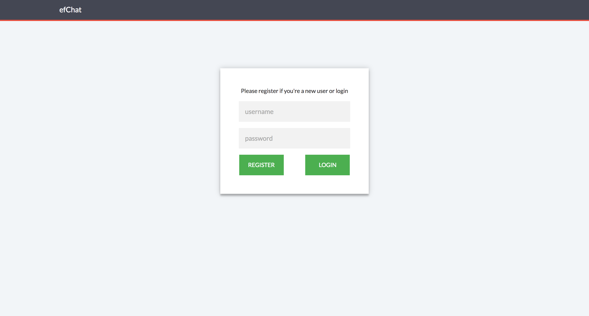
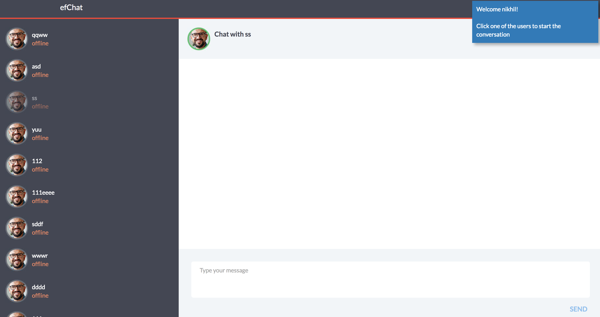
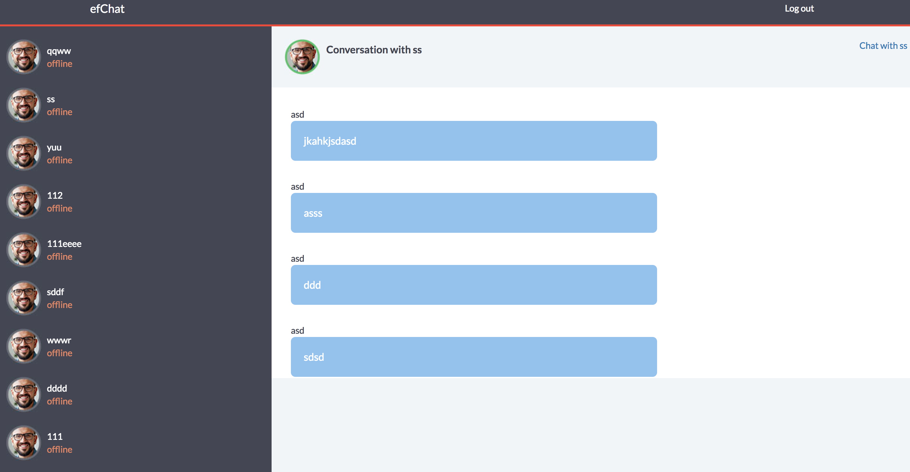

# efChat

### Client Build

1) Install **grunt** and **bower** using `npm install -g grunt-cli bower`

2) Clone the repo to your local directory.

3) Run `npm install` and `bower install` from the application root.

4) Run `grunt` or `grunt build` for building

5) Run `grunt serve` to preview the app in a default browser.

Note: These instructions are only to get the frontend up and running. The server has to be built and run parallelly for the apis to work.  

### Implementation Overview

Let me start by listing all the controllers and services in the SPA and dive into the details later.

> #### Controllers

HomeCtrl
- created only to access control outside the ng view scope - header, logout etc.
- makes use of `authenticateService`.

MainCtrl
- contains all the landing page, authentication(login / register) implementation including validation.
- makes use of `authenticateService`, `Notification` service

ChatRoomCtrl
- contains all the implementation within the chat room once the user is logged in successfully.
- Makes use of the `authenticateService`, `Notification` service, `messageService`, `websocketService`.

> #### Services

`Notification` - This is a library service provided by `angular-ui-notification`. This is used to show various warning, error, success notifications throughout the app to the user.
 
`authenticateService` - This is a service which holds methods to verify the username and password and also to logout a user.

`messageService` - This service is responsible for fetching all the registered users, sending a chat message and viewing the conversations with other users.

`websocketService` - This service is solely used to open a new websocket connection and listen to the events being sent from the server.

### Implementation in detail

> #### MainCtrl

- The root controller is MainCtrl, when the user launches the application he is redirected to the landing page where the user is asked to enter an username and password.
- The fields are validated and hence entering an empty value on either of these would notify the user.
- If the fields are valid, the username is username is stored in a `sessionStorage` for validating other data in the future.
- Since the login and register implementation is very identical in terms of same paramters being passed, same response data being sent from the server, except the change of URL.
- Hence I created a single method in the service and passed a third parameter named 'action' passed from the button click, based on which the URLs of the request is changed inside the service.
- This way a potential identical duplicate service is not created.
- Then based on the response, the appropriate notification is shown to the user - conflict in the credentials, invalid credentials or on success redirected to the chatroom.
- Only on success, the response token from the server is stored in a `sessionStorage` to be used later.

> #### ChatRoomCtrl

- The ChatRoomCtrl has an `init()` function to initialize few functions on the controller instantiation.
- This init function first fetches the registered users from the servers to display on the UI.
- Before which to avoid showing the current user as part of the registered user list, the response data is spliced removing the current user.
- The response array is also converted to an array of objects and a new property 'status' is added to real time change it later.
- Using a $scope would not advisable as the users and their statuses are listed in a ng-repeat loop.
- After the registered users, the next service call is made to open a websocket connection.
- The implementation of the websocket is separated in the `websocketService`, where the onmessage event is listening to the data being pushed from the server.
- Created a callback on the onmessage event which delivers the response to the controller.
- If any data is pushed from the server, response is checked for the appropriate 'topic' and necessary updates are made to the UI.
- On UserOnline event, it iterates through each existing user list & updates the status for the user who came online.
- On New user event, a notification is shown with the new users name.
- On Message event ie, when a user sends or receives a chat message.
- If the message is sent from the current user, the chat window is updated by pushing the message onto the `chatMessages` array.
- If the message is from the current conversant then the chat window is updated by pushing the message onto the `chatMessages` array.
- If the message is someone else to the current user then a notification is shown mentioning who the sender was. The conversation can be later viewed from the 'Get previous conversations' option.
- Once the current user clicks on one of the registered users to start a conversation, only then the chat window is shown.
- The chat window for a user gets updated as they chat showing who the message is from.
- Also on successful sending of a message, a notification is shown that the message has been sent.
- When in chat mode, the current user can also 'Get all previous conversations' with that user.
- Clicking on this would clear the chat window of the messages and open a new chat window with previous conversations listed.

> #### HomeCtrl 

- HomeCtrl is in the parent scope of both MainCtrl and ChatRoomCtrl, it is used only to access control outside of the ng view scope.
- This is mainly done to have control on the elements outside ng view like the header which has logout functionality etc.
- Instead of creating a rootScope to maintain the above a parent controller is much cleaner and advisable.
- It contains a scope variable `loggedin` to show/hide the logout button.
- The logout function calls the `authenticateService` which takes a token as a parameter.
- Once logged out, the `sessionStorage` data are cleared.

### Testing

- Since the application makes use of Auth token, we need to generate it by authenticating.
- Running `grunt test` will run the unit tests with karma.
- Or get into the /test directory and run the `karma start` command.
